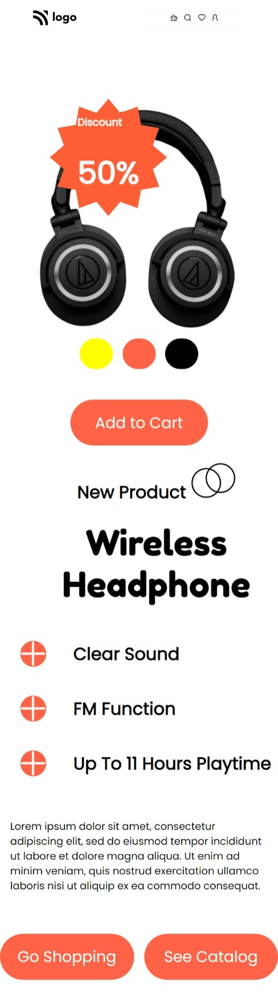
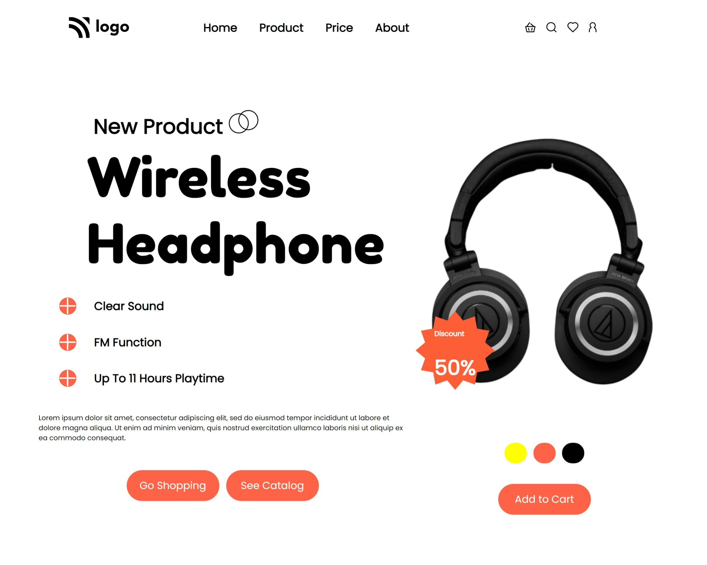

# 
**Project 07 - Priduct Home Page**

> ## Topics learnt in this project
- image placement properties
- creating shape such as circle with commands such "border radius, background colour"
- making page responsive, adding breakpoint at screen sizes 
   

> ## Time to complete this project 
> # **8 Hrs**

## **By : Kalpesh K Dhotre**
 

## [🌏 Deployed link](https://kd-project-07.netlify.app/)

 

## Below is screenshot of Mobile View & [Click here large screen view.](#large-screen-view)

 

 

# Large Screen View

 

## 
 [Back to top](#centerproject-07---priduct-home-pagecenter)
